# UML Diagrams for `internal/services/metadata`

```plantuml
@startuml

' Core Metadata Types

class MetadataManager {
  +GetDoc(id string): (DocInfo, error)
  +SaveDoc(doc DocInfo): error
  +ListDocs(): ([]DocInfo, error)
  +NewDocAnnotations(id string): (Annotations, error)
  +GetDocAnnotations(id string): (Annotations, error)
  +SaveAnnotations(annotations Annotations): error
  +Keystore: Keystore
}

class DocInfo {
  +ID: string
  +Data: []byte
  +ContentType: string
  +Created: time.Time
  +Updated: time.Time
  +Version: int
}

' Annotation Store

class Annotations {
  +DocID: string
  +Data: map[string]interface{}
  +Created: time.Time
  +Updated: time.Time
  +Version: int
}

class AnnotationsStore {
  +NewDocAnnotations(docID string): (Annotations, error)
  +GetDocAnnotations(docID string): (Annotations, error)
  +SaveAnnotations(annotations Annotations): error
}

' Keystore

interface Keystore {
  +GetPublicKey(id string): (interface{}, error)
  +GetPrivateKey(id string): (interface{}, error)
  +CreateKeyPair(id string, keyType KeyType, params interface{}): error
  +DeleteKeyPair(id string): error
  +ExportPublicKey(id string, format KeyFormat): ([]byte, error)
  +ImportPublicKey(id string, keyType KeyType, encodedKey []byte, format KeyFormat): error
}

enum KeyType {
  +RSA
  +ECDSA
  +Ed25519
}

enum KeyFormat {
  +PEM
  +PKIX
  +PKCS8
  +SSH
}

class FileKeystore {
  -keyDir: string
  -privateKeys: map[string]interface{}
  -publicKeys: map[string]interface{}
  +GetPublicKey(id string): (interface{}, error)
  +GetPrivateKey(id string): (interface{}, error)
  +CreateKeyPair(id string, keyType KeyType, params interface{}): error
  +DeleteKeyPair(id string): error
  +ExportPublicKey(id string, format KeyFormat): ([]byte, error)
  +ImportPublicKey(id string, keyType KeyType, encodedKey []byte, format KeyFormat): error
}

' Meta Tree

class MetaNode {
  +Path: string
  +Value: interface{}
  +Children: map[string]*MetaNode
}

class MetaTree {
  -root: *MetaNode
  +Get(path string): (interface{}, bool)
  +Set(path string, value interface{}): bool
  +Delete(path string): bool
  +List(prefix string): []string
  +Walk(visitor func(path string, value interface{}) bool)
  +ToMap(): map[string]interface{}
  +FromMap(m map[string]interface{})
}

' Proto Messages from meta.proto

class DocMetadata {
  +id: string
  +content_type: string
  +data: bytes
  +created: google.protobuf.Timestamp
  +updated: google.protobuf.Timestamp
  +version: int32
}

class DocAnnotation {
  +doc_id: string
  +data: map<string, google.protobuf.Any>
  +created: google.protobuf.Timestamp
  +updated: google.protobuf.Timestamp
  +version: int32
}

class GetDocRequest {
  +id: string
}

class GetDocResponse {
  +doc: DocMetadata
}

class SaveDocRequest {
  +doc: DocMetadata
}

class SaveDocResponse {
  +id: string
  +version: int32
}

class ListDocsRequest {
}

class ListDocsResponse {
  +docs: repeated DocMetadata
}

class GetAnnotationsRequest {
  +doc_id: string
}

class GetAnnotationsResponse {
  +annotation: DocAnnotation
}

class SaveAnnotationsRequest {
  +annotation: DocAnnotation
}

class SaveAnnotationsResponse {
  +doc_id: string
  +version: int32
}

interface MetaService {
  +GetDoc(GetDocRequest): GetDocResponse
  +SaveDoc(SaveDocRequest): SaveDocResponse
  +ListDocs(ListDocsRequest): ListDocsResponse
  +GetAnnotations(GetAnnotationsRequest): GetAnnotationsResponse
  +SaveAnnotations(SaveAnnotationsRequest): SaveAnnotationsResponse
}

' Relationships
MetadataManager --> DocInfo : manages
MetadataManager --> Annotations : manages
MetadataManager --> Keystore : uses
MetadataManager --> AnnotationsStore : uses
MetadataManager --> MetaTree : may use

AnnotationsStore --> Annotations : manages

FileKeystore ..|> Keystore : implements

' Proto relationships
DocInfo <.. DocMetadata : corresponds to
Annotations <.. DocAnnotation : corresponds to
MetaService --> DocMetadata : uses
MetaService --> DocAnnotation : uses

@enduml
```

> **Note:** This UML diagram represents the primary types and their relationships in the metadata service.
> The diagram is based on the exported types from annotation_store.go, keystore.go, meta_tree.go, metadata.go, and messages from meta.proto.
> To render this diagram, use a PlantUML plugin or online PlantUML renderer.
