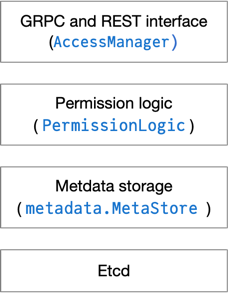

# The Access Manager Core

The access manager is implemented in layers as shown in the following digram

The `AccessManager` and `PermissionLogic` are in this package. The protobuf
definitions including the REST binding for the AccessManager are defined by the
`AccessManager` service in `protobuf/proto/accessmanager.proto`. 