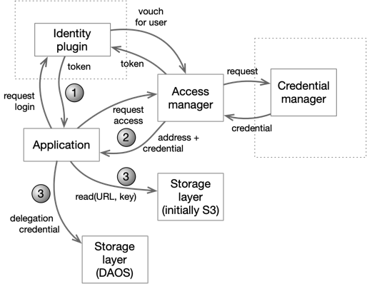

# General Introduction

The primary goal of Data Access Manager is, exactly as the name implies, to
control who can access which data. The manner of this control is important as
well. The access manager has these principles:

* simplicity - allow controls to be expressed simply and securely to minimize
  the chance of errors
* portability - provide uniform control over a range of data storage options
  with an extensible portfolio of authentication and authorization systems
* performance - using the access manager should generally not cause detectable
  performance degradation

The following figure illustrates how an application requests credentials from
the access manager but then goes directly to the data using those credentials:

In step 1, the user authenticates themselves to the access manager, in step 2,
they request access credentials for a particular data asset and in step 3, they
use those credentials to access data. In many cases, these operations are fused
together from a users's point of view or even completely invisible to them. For
instance, when accessing DAOS, all three steps may happen as part of the user
login process.

The key innovations of the Data Access Manager lie in the simplicity of the
logic used to decide which access to allow and the ease which new data storage
and authentication techniques can be integrated. Importantly, the constraints on
access are expressed in the same way that we express limits on who can modify
these constraints or which plugins can vouch for which users. All of this access
control metadata is kept in a concise and simple form which makes it easier for
users to understand what is happening. It also allows advanced capabilities such
as policy monitoring and formal proofs of secure configuration.

This document provides a general introduction into the concepts underlying the
Data Access Manager. More specific information about exactly how permissions
work can be found in other documents:

| Topic                                                                        | Description                                                                                                                               |
|------------------------------------------------------------------------------|-------------------------------------------------------------------------------------------------------------------------------------------|
| [Mechanics of access control](./practical-access-control.md)                    | Describes the directory structure and exactly how attributes and permissions are inherited in terms suitable for an application developer |
| [Operator/tenant/sub-tenant example](./example-permissions-1.md)             | Provides a worked example that shows how access can be controlled at a corporate, group and employee level                                |
| [Dev/production isolation example](./example-prod-dev.md)                    | Provides a worked example that shows how production and development can be isolated                                                       |
| [How identity is established](identity.md)                                   | Describes how user and workloads identities are verified by external systems                                                              | 
| External API                                                                 | Description of the externally accessible REST and gRPC API                                                                                |
| Source code structure                                                        | Describes how the source code for the different components of the Access Manager are laid out                                |
| Runbook                                                                      | Describes how to perform service maintenance operations                                                                                   |
| [Formal proofs for access control](formal-Characteristics-Of-Permissions.md) | Provides an introduction to the logical foundations of the Access Manager                                                                 | 
| [Internal data model](./internal-Data-Model.md)                              | Describes the internal data structures and internal APIs for the Access Manager                                              |

# The Use and Organization of Metadata

The Access Manager maintains information about the data being
managed, who might access that data, or even who can change access rights. This
information is collectively called "metadata".

The two most fundamental kinds of objects in the metadata are representations of
the users or applications and representations of individual datasets.

Each user, application or data set has a name in Access Manager. For data,
this name doesn't need to correlate with the actual location of the data, but
can be chosen to group related data together. User and application names are
similarly arbitrary.

Names are commonly arranged to reflect organizational or administrative
structures in the real world. To make it easier to reflect such structure, names
are arranged in folders or directories. A directory can, for instance, contain
all the users in a particular working group, or it might contain all the data
that working group produces. This ability to organize and group users, workloads
and data makes inheritance more useful (see the section on
[inheritance](#inheritance)).

The specifications of who can do what takes the form of _access control
expressions_
(sometimes abbreviated as ACEs) that are placed on directories, data, users or
other metadata. Each access control expression defines a limit on who can
perform a particular operation. For data, the obvious operations are read and
write, but all objects can also have access control expressions that limit who
can administer the object or who can even see it.

## How attributes and ACEs Work

In the Access Manager, the link between access control expressions
and users or workloads is not direct; access control expressions never mention
users or workloads directly.

Instead, access control expressions are defined in terms of *attributes*. These
attributes can, in turn, be applied to users workloads. This identification of
permitted actions via attributes instead of with individual identities is what
makes the access manager a role-based access control (RBAC) system. The virtue
of this is it allows access to be given to or taken away from users by giving
them a role or by removing a role. Viewed differently, if there is some set of
attributes that enable an operation, then any user with those attributes will be
allowed to do that operation.

Each access control expression limits a single operation on the object
associated with that expression. For that access to be granted to a user, the
user's attributes must satisfy
_all_ of the components of the access control expression. Each component is an
access control list (ACL) that contains a list of attributes. An access control
list is satisfied if the user has _any_ of the attributes in the list.

As an example, an ACE for the `Read` permission on a dataset might include ACLs
that require a) the user is an employee (they have `acme-user` role), b) that
they are a member of a particular working group (they have the
`acme/machine-learning` role), and c) that they are authorized to see the data
in question (they have the `acme/ml/raw-reader`
role).

## Inheritance

Having a separate access expression for every operation on every object in the
system would become very cumbersome, however, and difficult to manage. In
practice, groups of users or workloads some of their attributes with each other.
Similarly, groups of related data typically have very similar access controls.
In the previous example, we could expect that all of the employees of Acme
Corporation would share the `acme-user` role. Among these users, we would expect
that a large-ish subset would share the `acme/machine-learning`
role. Even at the finest granularity, we would expect that more than one user
would have the `acme/ml/raw-reader` role. There is a similar sort of redundancy
on the data side as well with wide commonality in the basic controls so we might
see a limitation that all ACME company data can only be read or written by users
with the `acme-user` role.

The Access Manager uses inheritance to handle this need for common user
attributes and common access controls. Adding a role to a directory has the
effect of adding that role to all users in that directory or in any child or
sub-child of that directory. Similarly, an access restriction on a data
directory limits what can be done on anything in that directory or in any child
of that directory.

It is also possible to limit the inheritance of access control expressions by
marking an access control expression as `local`. When this is done, that
expression limits access where it is attached, but does not limit access for any
children. This is typically done where you want to limit the administration of
top-level directories to organization-level administrators, but you want to
allow lower level administrators to control their own areas without having to
involve upper-level administrators.

## A Word about Attributes (not what you think)

Attributes in the Access Manager are different from roles in some
other systems. Attributes in the access manager do not imply any particular
access or power by themselves and users do not "assume" a role.

Instead, attributes are used to mark a set of users who have some similar level
of access or powers. For instance, the administrators in a particular group
might be marked with a `group-admin` role or all of the workloads that prepare
raw data might be marked as `raw-data-reader`. Furthermore, since there is a
directory structure for role names (just like everything else), we can collect
these attributes under different directories to distinguish similar attributes
for different groups so we might use
`am://role/acme/sales/group1/raw-data-reader` and
`am://role/acme/research/group1/raw-data-reader` to express different (but
somehow similar) attributes. Having a directory structure allows different
groups to use the same base name for a role without any collision.

## Meta-circularity

It is important to note that the ability to update the metadata in the Access
Manager controlled by the same kinds of ACEs that are used to control read and
write access to data. The ability to refer to attributes at all is controlled by
the `View` permission on `am://role` sub-directories, the ability to add an
attribute to a user or directory of users is controlled by the `Admin`
permission on the user(s) and the `ApplyRole` on the attribute itself.
Similarly, the ability to use an attribute in an ACE is limited to those who
have `UseRole`
permission on the attribute and `Admin` permission on the object where the ACE
is.

This property of the access control system controlling changes to the access
control metadata is called meta-circularity. Such a property is important
because it is what enables safe delegation and because it allows us to construct
mathematical proofs not only about what people and workloads can do in the
current state of the system, but also proofs about what people and workloads can
do even if those people and workloads make changes to permissions. On an
informal level, this property also lets us walk a human through an audit of
important properties. For instance, we might assert that "no outsider can access
our private data" and "nobody except these three administrators can cause that
assertion to become false" by simply noting that all of our data, attributes,
users and workloads are only visible to our users (because only those users and
workloads are tagged with the necessary `acme-user` attribute) and only our
admins can manipulate that attribute (because they are the only ones who have
permissions on the attribute). This argument is persuasive precisely because it
is so simple. That simplicity also makes it possible to formalize.

Note that the reason that such simplicity is possible is precisely because there
are no external mechanisms of control. There are no super-users who can come in
and wreck everything.

# Fundamental Project Guidelines

Here are the fundamental driving goals for the Access Manager:

# Scale

* manage tens of thousands of users/workloads
* manage access to tens of petabytes of data
* must handle access requests bursts from hundreds to thousands of threads
* must support transparent geo-distribution with no performance or complexity
  penalties
* support zero scheduled downtime across scaling, upgrades and technology changes
* allow transparent inter-operability on multiple clouds and on-premises
* formal proofs
  of [metadata durability/correctness](./Formal-Characteristics-of-Metadata-Update.md)

# Security model

* allow full multi-tenancy of data
* authn and authz should be independent of each other
* prevent single point of administrative compromise
* support and control selective encryption at rest
* must support data sovereignty constraints
* [fully interoperable with current and planned GLCP authn](./Authentication-and-Authorization.md)
  structures (particularly mTLS with Spire)
* formal proofs of
  key [access](./Formal-Characteristics-Of-Permissions.md)
  model characteristics

# Usability

* support access to data via existing open-source software with no patches
* support baseline example programs
* simple, explainable and (
  provable)[./Formal-Characteristics-Of-Permissions.md] permissioning
  model
* allow transparent use with existing storage credentialling methods
* allow orthogonal permissioning from independent teams on the same data
  elements
* allow controlled delegation of administrative controls
*

support phased rollouts and rollbacks
of all components

# Forensics

* support permission auditing per user or workload, per dataset, or per
  operation for any time in the past or present
* support access auditing per user or workload, per dataset, or per operation
* support separated logging of all access grants and changes
* permanently record all changes to permissions or attributes and allow forensic
  query of the history

# Future-proofing

* avoid cloud-locking through application portability
* allow mixed cloud and hybrid cloud transitions with no downtime
