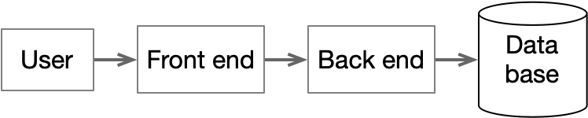

# Delegation Credentials
The basic structure of attributes and access control expressions combined with inheritance define the logic of how the access manager decides what is allowed in terms of access and metadata changes, but there are use cases where this basic structure isn't quite enough. 

In particular, the way that users or workloads get attributes by direct assignment or inheritance isn't quite sufficient in a number of situations. Delegation credentials are a very general method for dealing with these problems.

Situations where delegation credentials are useful include

* Fine-grained access control in databases - requires millions to billions of access checks per second
* the dashboard problem - a dashboard should get permission to read the right data from the user, but a user shouldn't be able to read a dashboard's database directly
* supporting 2-key administration - I have an attribute, you have a user, how can we collaborate safely?
* auditing delegation - a user, a front-end, a backend and the story of who gave what to whom
* end-to-end security - ACEs should be able to limit access to workloads running on secure platforms

The core idea is that the access manager supports a form of credential which provides a time-limited grant of attributes. In some cases, such as with row-level access control in a database, access decisions are made using just the attributes specified in the credential. In other cases such as in 2-key administration or building a dashboard the credential allows a way to dynamically augment the attributes a user or workload has.

# Use Case Details
## Feel the Need … for Speed
When data from multiple sources (say telemetry from different servers or sensors) is combined in a single database table, you gain efficiency in storage but also gain a big headache if the data from different sources have different visibility constraints. Delegation credentials were largely developed to deal with this problem of row-by-row visibility constraints in databases.

An important property of this use case is that a typical query may easily scan, filter, and possibly group and aggregate millions or possibly even billions of rows of data, each with a potentially different access constraint. The normal model of the access manager in which a round trip request to the access manager is made to decide whether an intended request is allowed is many orders of magnitude too slow. As such, these access control decisions must be made in-line as the data is read.

The way that this is implemented is that the tables that are available for querying are actually views composed by querying a composite of an underlying data table as filtered by the auxiliary tables that contain ACEs for columns, rows and fields. The first thing that happens when a database client makes contact with the database is to set a session level configuration variable with the delegation credential. The view for a table references fetches this configuration variable, validates the signature on it, and then compares the attribute list from the delegation credential against the ACEs for columns, rows and fields of any table being accessed. If the attributes allow `View` and `Read`, the actual data is returned. If only `View` is allowed, the data is returned in a masked form and otherwise, a `NULL` is returned.

To maximize performance, the view query is arranged with annotations to tell the database query optimizer that all access control decisions for rows and columns are immutable within a transaction so that they can be factored out of the hottest data path. Internally, the filtering code can use caching within a query to remember the result of previous access decisions when given the same ACE and optimizer-visible short-circuiting to avoid any masking if no ACE is specified for a field or row.

## The Dashboard Problem

The rough architecture of many web applications, particularly dashboard applications, look roughly like this

Requests start with the user (their browser, really), are sent to the front end where they are translated into RPC calls to the back-end which sends queries to the database. Each of these blocks may represent many replicas; there are commonly many users who may access many instances of the front end through a load balance and there are likely to be multiple back end services. Importantly, different users are likely to be allowed to see different data. In a system monitoring use case, one user might work for one company and have rights to see data for their machines while another might work for a different company and get to see different data. At small scales, it may be practical to clone the database for each customer but that leads to maintenance nightmares with more than a small handful of customers.

There are several problems that arise immediately with this architecture. 

* we don't want to give the back end the ability to access all data because that would directly require that we implement access controls in the back end. This imposes a very high risk of security holes that will be almost impossible to find and validate.
* we don't want to give the user or the front-end application the ability to send queries to the database directly, particularly if those queries could access or modify things outside the data that the user is allowed to see.
* we don't want the user to be able to send RPC requests to the back-end.

With delegation credentials, we can solve this problem very nicely. When the user logs in, they get a short-lived delegation credential that contains attributes that confirm the right to access some data via the dashboard. Importantly, though, these attributes do not suffice to access data in the database. When the browser sends requests to the front end, it includes this delegation credential. The front end decides which back end services to call and sends requests that include the delegation credential from the user. The back end enhances this credential with its own attributes and sends queries to the database using that enhanced credential. The access control for the database is set up to require several attributes for the duration of a user session:

* an attribute indicating that the back-end is a bona fide production instance
* an attribute indicating that the user has dashboard access in general
* attributes indicating which data the user is allowed to see

Requiring all of these attributes means that neither the front end nor the user can send requests directly to the database because they don't have the production back-end attribute. Symmetrically, the back end cannot see any data in the database unless it has a sufficient set of attributes passed to it from the user. When the combined privileges are passed to the database, the database handles the filtering of data on a row-by-row or even at a field level so that the back end only sees the appropriate data.

Because the front and back ends both operate with very low privileges from their own attributes this architecture solves many common security problems such as the confused deputy problem, or incorrect authorization. In addition, all access control can be handled coherently and centrally. That means if the back end needs some data from a database and some from an Iceberg table stored in AWS, the same permissioning scheme will be used.

## Two-key administration - I have an attribute, you have a user, how can we collaborate safely?
## Protocol sequence diagrams

## Auditing delegation - a user, a front-end, a backend and the story of who gave what to whom
## End-to-end security - locking access to platforms

* avoiding the entitled user problem - a user shouldn't be able to read a dashboard's database directly
* supporting 2-key administration - I have an attribute, you have a user, how can we colaborate safely?
* auditing delegation - a user, a front-end, a backend and the story of who gave what to whom

# Requesting and using a delegation credential
All access manager endpoints require a caller identity (and associated proof) and will shortly _allow_ an additional delegation credential. Providing a credential is all that you need to do to use it. To use a credential for data masking in a database query call the `SetAttributes` function with your credential at the start of your session.

The same API endpoint used to create a delegation credential can be used to extend one. If you call the creation endpoint with an existing delegation credential, you will get one back that mixes in your own attributes. Your attributes must satisfy the `target_ace` and `heritable_ace` ACEs on the credential you are extending. The credential creation endpoint also allows you to filter the list of attributes in the returned credential using a list of wildcard for the attribute URIs.
# Credential Contents
A delegation credential contains the following fields:
* uuid - a unique ID that can be used to track a chain of credentials
* start, end times - when is this credential valid?
* source - the identity who requested this credential
* target_ace - an access control expression that defines who can use this credential
* heritable_ace - an access control expression that defines who can create new credentials from this one
* attribute list - a list of the attributes granted by this credential
* signature - a public key signature by the access manager covering all of the previous fields