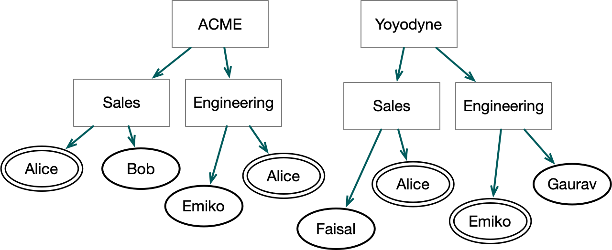

# Example - Multi-tenancy

This example shows how different companies can inhabit the same
namespace without being able to interfere with each others internal
operations.

The two companies in this example are the Acme Corporation (known as
Acme here) and Yoyodyne Industries (called Yoyodyne here). Both are
entirely fictitious, of course, but the problems of working together
while keeping most operations private is real.

Another problem with multi-tenancy is that there will inevitably be
name collisions on many levels. In this example, for instance, both
companies have departments called `sales` and `engineering` and all of
the employees have only a few distinct names even though they are all
different people to whom different policies apply. The following
diagram shows organizational structure with administrators for
different departments marked with doubled outlines.



There is another entity involved and that is the operator of
the entire namespace. Their responsibility is to give each company
initial access to the namespace and they are allowed to see which
companies exist, but they are not allowed to see or manipulate any
data or configuration for either company. The operator has the 
attribute `op-admin` and there is only a single user defined with
that attribute. In reality, there would be several such users, but that
isn't an important detail here.

# In the Beginning

Before there were any users in the system, the operator
prepared the namespace so that it looked like the following
```
`-- am/
    |-- data/        #perm(admin*=(am://role/op-admin),write*=(am://role/op-admin))
    |-- role/        #perm(admin*=(am://role/op-admin),write*=(am://role/op-admin))
    |   |
    |   `-- op-admin #role
    |                #perm(applyrole=(am://role/op-admin))
    |
    `-- user/        #perm(admin*=(am://role/op-admin),write*=(am://role/op-admin))
    |   |
    |   `-- operator #user(role=am://role/op-admin)
    |                #perm(view=(am://role/op-admin))
    |
    `-- workload/    #perm(admin*=(am://role/op-admin),write*=(am://role/op-admin))
```
The `*` on some permissions is used to indicate permissions that are not
inherited (i.e. `local` ACEs).

This arrangement sets things up so that only a user with `op-admin`
attribute can make any changes to the namespace or attribute assignments. As a
nice benefit, nobody except an operator administrator can even see
that the operator administrator exists. Paradoxically, however, any
user can include the operator in a permission expression. The reason
for that will come out when we discussion adding new structures like
a joint project.

To avoid clutter at each step, we won't show the permissions and attributes
defined in earlier steps. We also won't show the  `workload` top-level 
directory.

# Company Creation
When ACME and Yoyodyne first show up and ask to use the
access manager, the operator creates top-level directories and
delegates the right to administer the content of the corporate
directories to the admins for each company.

Both companies get set up the same way so we only show the arrangement for ACME
```
`-- am/
    |-- data/
    |   `-- acme/       #perm(admin*=(am://role/acme/admin),write*=(am://role/acme/admin))
    |                   #perm(view=(am://role/acme/user))
    |
    |-- role/
    |   |-- acme/       #perm(admin*=(am://role/acme/admin),write*=(am://role/acme/admin))
        |   |           #perm(view=(am://role/acme/user))
    |   |   |-- admin   #perm(applyrole=(am://role/acme/admin),userole=(am://role/acme/admin))
    |   |   |-- user    #perm(applyrole=(am://role/acme/admin),userole=(am://role/acme/admin))
    |   `-- op-admin
    |
    `-- user/
        |-- acme/       #perm(admin*=(am://role/acme/admin),write*=(am://role/acme/admin))
        |   |           #perm(view=(am://role/acme/user))
        |   |           #role(am://role/acme/user)
        |   |
        |   `-- george  #role(am://role/acme/admin)
        `-- operator
```
The arrangement here sets things up so that only ACME users can that
see any top-level ACME directory. Conveniently, users defined under
`am://user/acme` will inherit that attribute. George not only inherits 
`am://role/acme/user`, he also has the attribute `am://role/acme/admin` 
applied just to him which makes him the
initial administrator for ACME and he gets the right to manipulate the
initial ACME attributes and to write to or administer any of the ACME top-level
directories. Notably, the operator (who is not George) has no visibility into or control
over any ACME directory.

# Independent Operation and Sub-tenancy

From this point the initial company administrator, George, can create users, attributes,
and directories for ACME. For instance, suppose we have some additional users in 
two departments. George can set this up:
```
    |
    |-- role
    |   |-- acme
    |       |-- admin
    |       |-- user
    |       |-- engineering
    |       |   `-- admin         #perm(applyrole=(am://role/acme/admin,am://role/acme/engineering/admin))
    |       |                     #perm(userole=(am://role/acme/admin,am://role/acme/engineering/admin))
    |       `-- sales
    |           `-- admin         #perm(applyrole=(am://role/acme/admin,am://role/acme/engineering/admin))
    |                             #perm(userole=(am://role/acme/admin,am://role/acme/engineering/admin))
    |
    `-- user
        `-- acme
            |-- george
            |-- engineering        #perm(admin*=(am://role/acme/admin),write=(am://role/acme/engineering/admin))
            |   |-- alice          #role(am://role/acme/admin,am://role/acme/engineering/admin)
            |   `-- bob
            `-- sales              #perm(admin*=(am://role/acme/admin),write=(am://role/acme/engineering/admin))
                |-- alice          #role(am://role/acme/sales/admin)
                `-- emiko

```
This does two things. For one, George has recruited the user
`acme/engineeering/alice` as a co-administrator of ACME in general. A
second thing that this does is it mirrors the way that the namespace
operator delegated authority over ACME to George. Essentially George
is not just a tenant to the overall operator, he also serves as
an operator to the sales and engineering departments as he delegates
control to each department. Even so, however, George can't exceed the 
bounds set by the namespace operator and he can't delegate rights beyond
those set by the original grant by the namespace operator.

Note particularly, that `acme/engineering/alice` and `acme/sales/alice` 
are two different identities with different attributes. The entire path is
significant in distinguishing them.

# Real Multi-tenancy

Suppose now that the operator creates a second company, Yoyodyne, in
the same way as the first. ACME has a permission at their top level
that limits `View` rights to users with the attribute
`am://role/acme/user`. Symmetrically, Yoyodyne will have a `View`
limitation to `am://role/yoyodyne/user`. Since the ACME user attribute can
only be had by inheriting it from `am://role/acme`, no Yoyodyne user
will have it and thus no Yoyodyne user will be able to see that ACME even
exists. Conversely, the same holds in reverse for ACME users who will
not be able to see Yoyodyne.

Both companies will, however, be able to function internally without
any limitation because they have all the rights that they need. Even
the operator can't change this.

# A Joint Venture

If you remember from the original state, the administrator has given
everyone in the system the right to include `op-admin` in any permission
expression. By doing this, the operator reserves the right to be invited
into any structure if needed. This can come in handy if, for instance,
ACME wants to do something collaborative with Yoyodyne because neither
company has any power to manipulate (or even observe) anything about the
other company. Both companies, however, can give the operator strictly
limited powers over special purpose attributes which allow the creation 
of a common use area.

To be specific, ACME can create an attribute `am://role/acme/joint` and 
give `UseRole` and `View` permission to the attribute `am://role/op-admin`. Yoyodyne
can do likewise with the attribute `am://role/yoyodyne/joint`.

At this point, the operator can create a `shared-access` directory
like this:
```
`-- am
    |-- data
    |   `-- shared-access/ #perm(admin*=(am://role/acme/joint,am://role/yoyodyne/joint))
    |   
    |-- role
    |   `-- shared-access/ #perm(admin*=(am://role/acme/joint,am://role/yoyodyne/joint))
    |
    `-- user
        `-- shared-access/ #perm(admin*=(am://role/acme/joint,am://role/yoyodyne/joint))
```
With this structure, administrators in either organization can
independently manipulate the properties and permissions of this shared
use area. Most importantly, they will be able to create shared attributes
that can be applied to users in either organization. Those shared
attributes can then be used to allow visibility and access to shared data.

The important aspect of this process of building up a jointly
controlled entity is not so much that such a structure can be created,
but that it can be created incrementally *after* both organizations
have already excluded any common entity from any administrative
function in their own areas. The trick is that the operator left open
the opportunity to be invited back in so they could be a mediator.

# Key Lessons

There are several interesting points to this example:

* An operator/tenant model is possible in which the operator has the
  right to create structures for organizations and also the right to
  relinquish administrative control over those structures.
* Multiple organization can be tenants in the same namespace without
  any possiblity of interference each to the other. Permissions can
  actually be drawn so tightly that neither organization can even see
  the other and not even the operator can pierce this invisibility.
* Even after organizations build mutually invisible structures, it is
  also possible to collaborate, but only with the assent of both
  parties.
* Complex policies can be implemented using the access manager using
  relatively simple patterns while preserving independence of
  governance within an organization.
