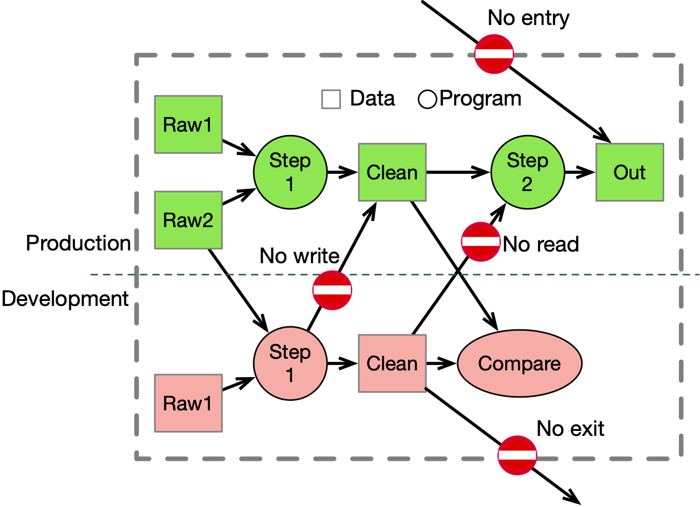

# Example - Isolation of a Trusted Data Pipeline

This example illustrates how trusted and secure data pipeline can work with
development and production versions of the pipeline components. The requirements
include:

* Trusted output data must only be produced by trusted workloads using only
  trusted data as input.
* It should be possible to stage developmental versions of the production pipeline
  components that can read production data but not write to the production
  output data. The output of these non-production components must also not be
  readable by the production pipeline.
* Neither the production pipeline components nor the development pipeline
  components should be able to read or write data outside the security boundary.

Here is a picture in Figure 1. The production pipeline consists of two steps
that are represented by green circles. It involves data consumed and produced by
these steps shown here as are green squares. Step 1 reads two kinds of raw data
and produces the data labeled `Clean` which is then processed by Step 2.

<div style="padding-left: 20px;">


**_Figure 1_**. A secure data production and developmental pipeline with
internal and external security isolation.
</div>

In the development environment which is below the dashed line and marked as red,
we are working on Step 1 and have our own copy of Raw 1. Our goal is to safely
develop code and check the results. To do this, we want to read the production
Raw 2 data. We also want to be sure that we can't overwrite the production
version of `Clean` data, but that we can write our own development version. We
also want to be sure that production Step 2 cannot read our development version
of the `Clean` data. To verify our work, we want a comparison function to be
able to read both production and development versions of `Clean` data. The basic
idea is that data can cross the dashed line downwards, but cannot cross back
upwards.

As a bonus, we want to make sure that developers can't mess with the safeguards,
but also that they don't need to. As one more bonus, we want any governance for
production/development separation to be independent of any other governance so
that it neither opens up any security holes nor does it interfere with the
administration of other data governance.

# Permission structure

The permission structure shown here is one way to implement this restriction
that meets the requirements and delivers the bonus points. This structure is
also useful as an illustration of how to use agent permissions as opposed to the
more common target permissions. Agent permissions place permissions on the
workloads and attributes on the data instead of the other way around.

There are two attributes of interest, one for production workloads (`prod`) and
one for development workloads (`dev`). These attributes are isolated in an
application-specific directory to avoid interference with other applications.
These attributes are managed by the developers or team administrator as part of
the basic application development environment.

```
am://role/acme/pipeline
    prod
    dev
```

This directory should be protected so that only the team responsible for the
pipeline can modify the permissions inside.

Then we have the data itself that is placed into two directories, `prod` and
`dev` under a common directory for the pipeline. Each data directory has the
corresponding attribute with the same name applied to it.

```
am://data/acme/
    prod/ #applied-role: am://role/acme/prod
       Raw1
       Raw2
       Clean
       Out
    dev/  #applied-role: am://role/acme/dev
       Raw1
       Clean
```

The workloads are also placed into two directories and permissions are applied
to these directories that prevent the workloads from even seeing data they are
not allowed to read or write.

```
am://data/acme/pipeline
    prod/ #perm {View, [[am://role/acme/prod]]}
        Step1
        Step2
    dev/  #perm {View, [[am://role/acme/dev, am://role/acme/prod]]}
        Step1
        Compare
```

Note that neither `prod` nor `dev` workloads can see data outside the security
boundary.

# Deploying New Workloads

When a new workload is deployed, it is simply placed into the appropriate
directory (`prod` or `dev`) and the appropriate permissions are applied by
inheritance. This is advantageous because it means that the deployment process
does not need to be aware of the security structure, nor does it need to be able
to modify these permissions.

# Formal Policies
The policies that apply to this example can be written in a formal style suitable for
machine verification.

In this formal style we use the expression `x < Y` to mean that the directory or 
object `x` is a direct or indirect child of directory `Y`. We also write `(agent action target)` 
to mean that user or workload `agent` can perform `action` on the `target`. Other than
these special purpose notations, we also use ∧ to mean logical and, ¬ to mean logical negation
and `x→y` to mean that `x` implies `y`.

We start with some definitions for the workload and data directories
```
W = am://workload/acme/pipeline
D = am://data/acme/pipeline
```
1. Pipeline workloads (dev or production) cannot see that data outside the pipeline.
```
      p < W ∧ ¬(d < D) → ¬ (p View d)
```
2. Production workloads cannot see data outside the production data directory
```
      p < W/prod ∧ ¬(d < D/prod) → ¬ (p View d)
```
3. Production workloads _can_ see production data
```
      p < W/prod ∧ (d < D/prod) → (p View d)
```
4. Development workloads can see all pipeline data
```
      p < W/dev ∧ (d < D) → (p View d)
```

# Takeaway Lessons

The key points here are:

* workloads and data get the right roles and permissions by inheritance not by
  developer configuration
* developers never touch the critical roles and permissions, so they won't mess them up
* promotion to production status is simple and protected
* all necessary administrative privileges can be safely delegated to these teams
  without compromising enterprise scale constraints
* all data governance inherited from above this structure is unaffected
* all workload level governance is unaffected by this structure as long as it
  does not conflict with the permissions here
