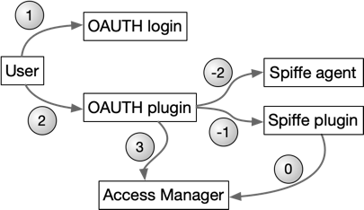
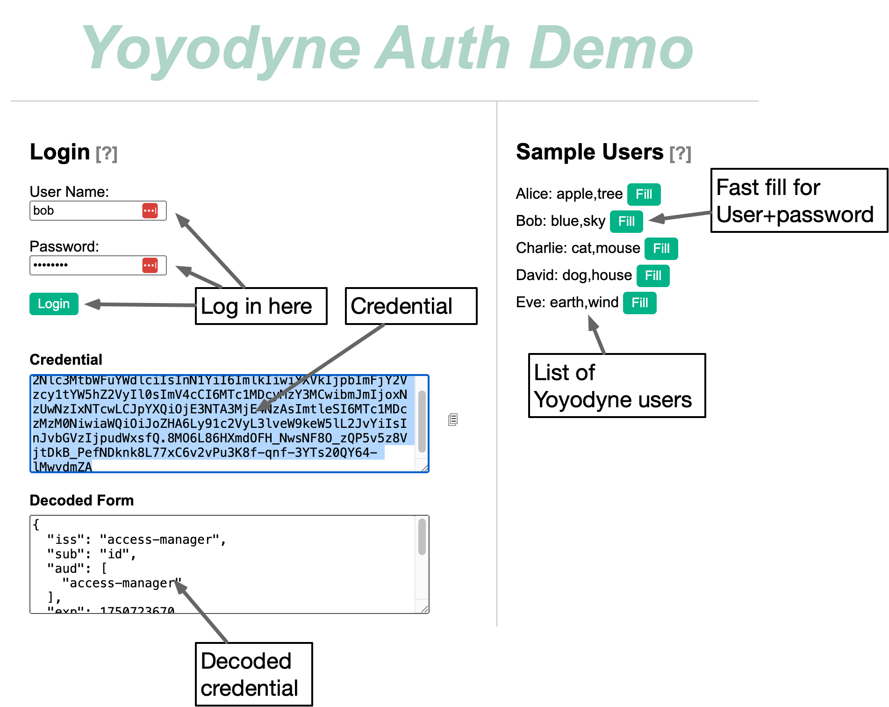
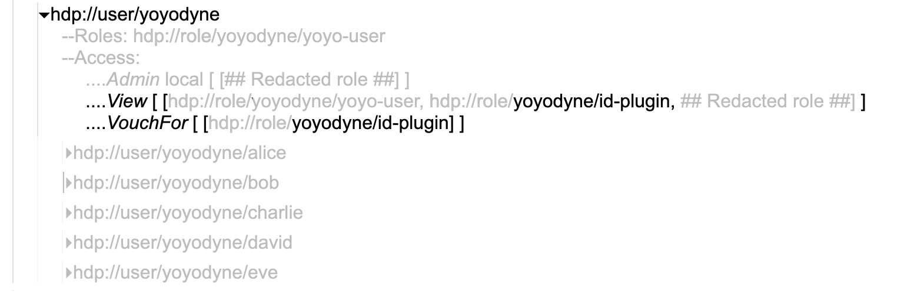
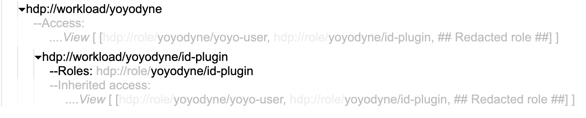

# Identity management in the Access Manager

One of the core tenets of the Access Manager is that "identity" is different from "authentication". There is a clear need for a way to describe access control around an identity, but the reality is that there will be many ways to prove that you or some workload have the right to claim that identity. Even worse, different organizations will have conflicting views about how to prove an identity, but they will still have a need to express access controls on shared data assets. Even in a single organization, normal tool churn will typically result in a situation with the previous system (that is still being used), the current system (that is not universally used) and the inevitable upcoming standard (that some people will have adopted already).

The goals of identity management in the Access Manager include

* identities must have a canonical name
* a single identity may have more more than one way for a principal to prove they are entitled to use it
* different organizations should be able to manage their own identity frameworks
* external identity management systems like OAuth, ssh-agent and Spiffe should
  be easy to integrate without changing most applications
* transition from one identity management system to another should be seamless
* it should be possible to build toy scenarios with minimal integration overhead
* no secrets should be stored in the Access Manager itself. Each identity plugin
  is responsible for it's own security architecture
* all identity credentials are time-limited
* all Access Manager API end-points are secured by signed bearer credential, but
  the credential does not sign the transaction itself
* compromise of one identity management should not affect users not using that
  framework
* there should be a backup way to establish critical identities for platform
  administration or in case an external identity management system fails

To support these goals there are three modes of user and workload identity
management, demonstration identities, internally managed and externally managed.
If any internal or external management is defined for a user or group of users,
then these users cannot be used in demonstration mode, but aside from that
limitation, individual identities can use multiple forms of identity management
at the same time.

The demo management is not intended to provide more than a token level of
security. Most production uses will primarily use externally managed identities
with very limited use of internally managed identities.

# Demonstration identity management

Any identities which have no ssh public keys attached to them and which do not
have any identity plugins allowed to vouch for them are referred to as
demonstration identities. Such identities can use the URL of their own identity
as a credential with no need to sign the credential.

Demonstration identities provide are useful for trial usage or to demonstrate
the function of the Access Manager without any unnecessary overhead, but they
provide essentially no real security. Any identities that have or inherit
`VouchFor` permissions cannot be used in demonstration mode. The same applies if
there are any `ssh-public-key` annotations on the identity. If either of these
two conditions apply, a properly signed credential for that identity must be
obtained and used instead.

# Internally managed identities

Any user or workload that has an `ssh-public-key` annotation can obtain an API
credential by ssh'ing to an instance of the Access Manager. If this access is
allowed using normal ssh protocols, the Access Manager will generate a signed,
time-limited credential for that user or workload and send it back before
closing the ssh connection. The content of that credential can be used as the
`callerId` parameter in calls to Access Manager API until the credential
expires.

As an example, suppose that user "Fred Frankenbert" is logged in as "fred" on a
Linux machine. In the process of logging in, Fred has established a connection
to the ssh-agent on the Linux machine back to their laptop which has an RSA
private key corresponding to the public key annotation attached to the
`am:/user/yoyodyne/admin/frankenbert` identity. Fred can use the following
command to get an access manager credential for that identity as shown below:

```shell
$ ssh -l am://user/yoyodyne/admin/frankenbert -p 2222 access-manager-01.yoyodyne.com
eyJhbGciOiJSUzI1NiIsInR5cCI6IkpXVCJ9.eyJpc3MiOiJhY2Nlc3MtbWF...
```

If Fred were about to run a workload with its own identity distinct from his, he
could obtain a credential for that workload instead of for himself (assuming
that one of his ssh keys is attached to the workload) by the same process except
that the workload's identity URL would be used instead of his own.

Network access to the ssh port on an Access Manager can also be limited to hosts
on a particular network segment to provide additional control for internally
managed identities.

# Externally managed identities

Adding ssh keys to identities in the Access Manager is a fine way to control
access at a limited scale, but it isn't sufficient for a larger group. In those
cases, it is better to take advantage of an external system of record such as
LDAP, Active directory or an OAUTH server. These services might be provided
internally or as part of a managed service such as Okta.

In this case, an Access Manager credential can be obtained by identitying
yourself to a program known as an identity plugin. This program uses your normal
sign-in procedures to validate a user's identity and then makes a request with
its own Access Manager credential to get a credential for the user in question.
The Access Manager will determine whether the plugin's identity has `VouchFor`
permission for the user and, if so, will generate and return that credential to
be forwarded on to the user. The plugin will need to get its own credential
ahead of time, of course. To do so, it might use yet another identity plugin, or
it could use the internal ssh mechanism to prove its identity. The following
diagram shows how this might work in an environment that uses OAUTH to
authenticate users and Spiffe to authenticate programs.



In this diagram, certain preparations would be made before any user requests are
handled. These include starting the OAUTH plugin. As part of its startup
rituals, the OAUTH plugin would get a Spiffe id (SVID) from the Spiffe agent at
time -2. Then at time -1, the OAUTH plugin would use that SVID to ask the Spiffe
plugin for a credential. The Spiffe plugin would itself be authenticated to the
Access Manager ahead of that time using ssh as an internal identity. The Spiffe
plugin would request a credential for the OAUTH plugin at time 0 and the system
would be ready for user requests.

A user could get an OAUTH credential at time 1 and use that credential at time 2
to ask the OAUTH plugin for an Access Manager credential which would ask for
that credential and forward it back to the user at time 3.

The permissions required for this framework would include

- the Spiffe plugin would need an ssh public key on its identity
- the Spiffe plugin would need `VouchFor` permission on the OAUTH plugin's
  identity.
- The OAUTH plugin would require `VouchFor` permission on the user doing the
  login.

Most of this process would be invisible to the user. For instance, this might be
the login process for a website that does administrative operations on objects
in the Access Manager. The user would see their normal login process, but would
not see any of the operations required to turn a successful login into an Access
Manager credential, nor would they see the credential itself.

# Extensions

This framework provides the basis of [attribute delegation credentials](./delegation-credentials.md). The basic
idea is that a delegation credential can export some of the attributes you have
access to a time-limited credential. If allowed, a delegation credential can be
combined with some other credential to build a new delegation credential with
additional attributes. These delegation credentials are the basis of the SQL
row/column/field access control and also the DAOS integration.

# Examples

Here are a few examples that show how different authnentication modes work with
the Access Manager. Each of these examples is a complete example that can be run
separately. You should run these on a local instance of the Access Manager so
that you can delete all of the metadata without worrying about impinging on
other users. Keep in mind also that the `etcd` instance in these examples is
being run in a promiscuous way without any security. This is not a good idea in
production, but is fine for these examples. In production, you should be using
`etcd` with TLS and authentication. See
the [etcd documentation](https://etcd.io/docs/) for more information.

## Pre-requisites

To run these examples, you will need to install and run `etcd`.

```shell
go install go.etcd.io/etcd/v3
```

Then run `etcd` with the following command:

```shell
etcd 
```

You will also need to have the Access Manager running. You can do this by
running the following command:

```shell
go run cmd/access-manager/main.go
```

from the project directory of the Access Manager. This will start the Access
Manager on port 8080.

At this point, you can compile the command line utility by changing to the
`cmd/am` directory and running `go build`. This will create a command line
program called `am` that is used in the examples below.

At any point in the examples, it may be useful to examine the contents of the
`etcd` instance. You can do this by running the following command:

```shell
etcdctl get "" --prefix --keys-only
```

The private credential signing keys are stored in the `etcd` instance under the
`/keys` prefix. The actual metadata is stored with the /meta prefix.

## Example 1: Demonstration identity and inherent authentication

Start by clearing out the `etcd` instance. You can do this by running the
following command:

```shell
etcdctl del "" --prefix
```

Then run the following command to load the minimal metadata for the top level
diretories and the `operator-admin` user:

```shell
am boot bootstrap
```

At this point, you have a working Access Manager with a single user and no other
identities. Because we haven't loaded any ssh keys, we can simply tell the
Access Manager the identity we want to use, and it will trust us. We can list
all of the contents of the metadata tree with the following command:

```shell
export AM_URL=http://localhost:8080
export ACCESS_MANAGER_USER=am://user/operator-admin 
./am ls -r am://
```

This will show you the contents of the metadata tree. You should see something
like this (your version will be spread out a bit more):

```shell
{
   "path": "am://",
   "children": [
      {
         "path": "am://data"
      },
      {
         "path": "am://role",
         "children": [ { "path": "am://role/operator-admin" } ]
      },
      {
         "path": "am://user",
         "children": [ {"path": "am://user/the-operator"} ]
      },
      {"path": "am://workload"}
   ]
}
```

The reason that the Access Manager is willing to trust us is that the
`operator-admin` identity has no ssh keys and no identity plugins that can vouch
for it. Any identity that has either of these two things cannot be used in
demonstration mode.

We can add an ssh public key to the `operator-admin` identity by running the
following command:

```shell
./am  annotate  am://user/the-operator "ssh-pubkey=$(cat ~/.ssh/id_rsa.pub)"
```

This adds the public key from our `.ssh` directory to the `operator-admin`
identity as an annotation with the tag `ssh-pubkey`. You can see the contents of
the annotation by running the following command:

```shell
./am  ls -l am://am/user/the-operator
```

Unfortunately, this will not work because the `operator-admin` identity is now
no longer in demonstration mode. The Access Manager will not allow us to simply
tell it the identity we want to use. That means you will get an error message
like this:

```shell
failed to get details: error getting data: am://user/the-operator has ssh key, can't use plaintext ID
[]
```

To fix this, we need to get a credential for the `operator-admin` identity. The
Access Manager will give us such a credential if we can prove that we have the
private key that corresponds to the public key we just added. We can do this by
ssh'ing to the Access Manager itself. If the ssh connection is allowed, the
Access Manager will generate a signed, time-limited credential for the
`operator-admin` identity and send it back before closing the ssh connection.

Typically, we store the credential in a file for later use. This
command will do that:

```shell
mkdir credentials ; chmod 700 credentials
ssh -l am://user/the-operator -p 2222 localhost > ./credentials/id
```

Note that we put the credential in a directory called `credentials` that is not
readable except by us. That prevents snoops from seeing it.

Now we can use the credential to list the contents of the metadata tree again by
changing how we tell the Access Manager who we are.

```shell
export AM_URL=@./credentials/id
./am ls -r am://
```

This will show you the contents of the metadata tree again.

Note that if you wait long enough, the credential will expire, and you will need
to get a new one. When the credential expires, you will get an error message
like this:

```shell
failed to get details: error getting data: key has already expired
```

You can get a new credential by running the ssh command again to fix this.

You can remove the ssh key from the `operator-admin` identity with the `am rm`
command. First, you need to get the unique id (`4803141183792612` in the case
below) of the ssh key annotation using `am ls -l` and then you need to use that
id in the `am rm` command. For example first we get the unique id with this command:

```shell
$ ./am  ls -l am://am/user/the-operator | tail -14
            "tag": "principal",
            "unique": 2832733394143770,
            "version": 1
         },
         {
            "data": "ssh-rsa AAAAB3NzaC1yc2EAAA... stuff deleted ...FUrAkRueC7GtFaQ== fooble@corkmud.local",
            "tag": "ssh-pubkey",
            "unique": 4803141183792612,
            "version": 1
         }
      ],
      "isDirectory": true
   },
}
```
And then we remove the annotation and check our work with these commands
```shell
$ ./am  rm am://user/the-operator#ssh-pubkey-4803141183792612
$ ./am  ls -l am://am/user/the-operator | tail -12          
         }
      ],
      "annotations": [
         {
            "tag": "principal",
            "unique": 2832733394143770,
            "version": 1
         }
      ],
      "isDirectory": true
   },
}
```
## Example 2: Externally managed identities
An externally managed identity is an identity vouched for by a trusted workload known as an identity plugin. The identity plugin itself has an identity (which is usually internally managed) that has an attribute which grants the identity plugin the right to `View` and `VouchFor` the externally managed identities. With these operations allowed, the plugin can request a credential for the externally managed identities. The typical process is that the user will perform some action to convince the plugin that they are entitled to use one of the externally managed identities. Once the plugin is convinced, it requests a credential for that user and passes it back to the user.

This process is demonstrated by the `plugin` single page web application. The `plugin` demo is not a realistic demonstration, but instead is intended to show how the process works. The demo is specialized for the hypothetical company Yoyodyne which has five users in the access manager demo universe. The `plugin` application shows these users together with their "passwords" and allows you to log in as any one of these users.

This is shown in the following figure



In a real application, the user would typically just see a normal login process and would never see or manipulate their credential.

The permissions for setting this up look like this:


Here unimportant settings have been grayed out. What remains are the `View` and `VouchFor` permissions which include `am://role/yoyodyne/id-plugin`. On the plugin itself, we see the `am://role/yoyodyne/id-plugin` attribute

