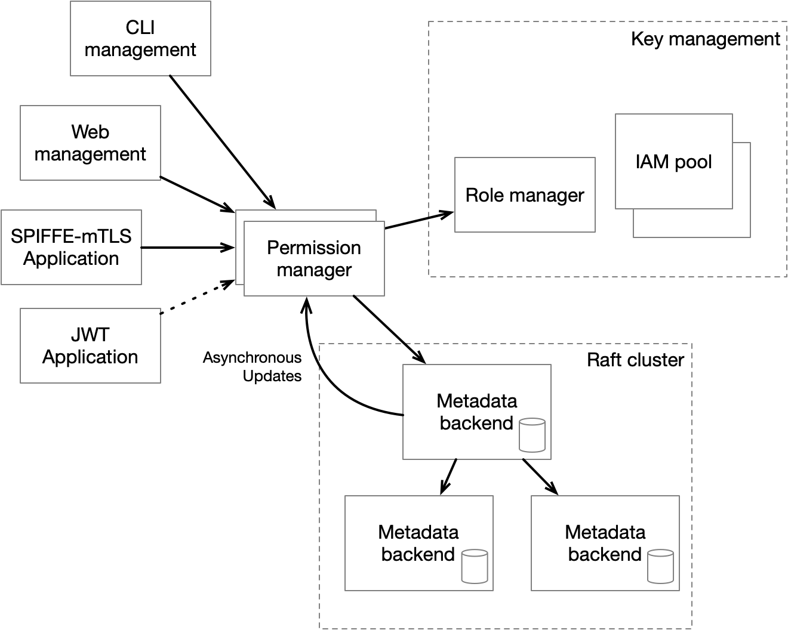

# Data Model

The data model for the Access Manager consists of meta-data that is stored in a conceptual tree of path
names organized by directory structures. Each leaf of the tree is associated with a dataset, user, workload or 
role definition. Any node of the tree, whether interior or leaf can have a list of access control expressions 
(ACEs). In addition, any interior or leaf in the user or workload sub-trees can have a list of roles attached.

All path names are prefixed by `am://` and there are exactly four directories below this root, `am://data` for 
data, `am://role` for roles, `am://user` for users and `am://workload` for workloads. Conventionally, there 
is a user `am://user/the-operator` who has the single role `am://role/operator-admin`. Administration
for `am://`, `am://data`, `am://role`, `am://user`, and `am://workload` paths is limited by a local 
(non-inherited) access control on the `Admin` permission granted solely to the `operator-admin` role.
Further, the visibility of `the-operator` and their associated role is limited to that same role.

Internally, all of this data is implemented as a map from path name to a list of meta-data packets. 
The packets on any path can contain any of access control expressions (ACEs), or roles applied to that path.
Leaf nodes can have a) a data definition, b) a role definition, or 
c) a principal (user or workload) definition. To repeat, ACEs (a) can appear anywhere, applied roles (b) 
can appear under `am://user` or `am://workload`, data definitions can appear on leaves under `am://data`,
role definitions can appear as leaves under `am://role` and principals can appear as leaves under 
`am://user` or `am://workload`.

ACEs consist of an operation (one of `View`, `Admin`, `Read`, `Write`, `ApplyRole` or `UseRole`) and a list
of ACLs. Each ACL is a list of roles. Permission for a particular operation is granted for a user or workload
if the effective ACEs for the operation are all satisified. Each ACE is granted if all of the component ACLs 
are granted. Each ACL is satisfied if any of the roles in the ACL are in the effective roles of the user or 
workload.

# Atomic Updates

Meta-data packets are added or updated atomically and all atomic updates to the state of meta-data are retained
in a serialized log of changes. This log defines the order of all changes so each update is assigned a global
transaction number. Each packet has its own version number as well. This packet-level version number is used
to allow consistent read-modify-write operations on packets by recording the version number when the packet is
read and then using that version number when data is written back. Two special version numbers (0 and 1) are used
to signal the creation of a new object and the unconditional update of a new or existing object respectively.

The internal structure of the access manager is to have front-end processes known as permission managers 
that do the work of evaluating whether roles and ACEs align enough to allow an operation to go forward. Most
operations do not require meta-data mutation and thus can be evaluated by any permission manager 
independently as long as the cached meta-data in the permission manager is not too far out of data.

Operations that require mutation of meta-data are sent to the backend process known as the meta-data backend
that maintains a globally consistent view of all meta-data. This backend is where the version numbers are 
checked to allow consistent updates of meta-data. The permission managers subscribe to the meta-data 
store and get updates. Time tick transactions are inserted at a relatively high rate (1-10 per second) so
that permission managers can quickly detect if their connection to the meta-data backend has been 
interrupted. Clients for the permission managers (normally applications) retain the last global 
transaction number that they have seen so that if they suddenly reconnect to a different permission 
controller, the permission manager can ensure that it will not expose any regression in the meta-data
state to the client application.

If the quorum of meta-data backend processes breaks down, everything can continue except for metadata 
mutations. This means that we can build a highly available, globally consistent meta-data backend that 
can continue at full speed for almost all operations even in a large-scale network partition.

# Inheritance of Access Controls
An path is said to have a set of "effective permissions" consisting of any access control expressions
defined at that path combined with any access control expressions defined at any proper prefix of that
path except for so-call direct expressions. An operation is said to be allowed for a user relative to
a path if that user's effective roles (see next section) are sufficient to satisfy every access control 
lists for that operation in the effective permissions for the path in question.

The meaning of the operations are described in the following table

| Operation   | Meaning                                                                                                                                                                                                                                                                                                                                          | 
|-------------|--------------------------------------------------------------------------------------------------------------------------------------------------------------------------------------------------------------------------------------------------------------------------------------------------------------------------------------------------|
| `Admin`     | Limits the manipulation of permissions and roles as well as the creation and deletion of paths                                                                                                                                                                                                                                                   |
| `Read`      | Limits the ability to get credentials to read data                                                                                                                                                                                                                                                                                               | 
| `Write`     | Limits the ability to get credentials to write data                                                                                                                                                                                                                                                                                              |
| `ApplyRole` | To apply a role to a path, a user or workload must have `ApplyRole` permission on the role and `Admin` on the path. Further, they must have `View` permission on both the role and the path.                                                                                                                                                     | 
| `UseRole`   | To add or remove a role from an access control list within an access control expression, a user or workload must have `UseRole` permission on all of the roles in the access control list. In addition, they must have `Admin` on the path where the access control expression is found as well as `View` on the roles in the ACL and the path.  |
| `View`      | The `View` permission controls overall visibility of metadata elements, permissions and roles in the data access manager. In addition, any roles applied to users or workloads will be redacted if a user doesn't have `View` permission for those roles. Also, any operation in general will require `View` permission on all involved entites. |
| `VouchFor` | The `VouchFor` permission controls the ability of an identity plugin to vouch for a user or workload's right to claim an identity. If the identity plugin, which is just a workload itself, has the necessary attributes to have this opinion, it can ask for an access manager credential on behalf of the original user or workload. |

# Inheritance of Roles
A user or workload at a particular path is said to have a set of "effective roles" which consists of 
the roles applied directly at that path or applied at any proper prefix of that path. Applied roles
are always inherited in this way.

While the `View` permission pervasively limits certain actions to only be applied or affect entities which
are visible to the user or workload taking the action, it does not limit the operation of any access control
or the inheritance of a role. Thus, the operations that a user can perform is controlled by their effective
roles even if they do not have `View` permission on those roles. Likewise, the ability of a user to see the
details of an access control expression does not change the effect of that expression.

# Process Communication

The Access Manager consists of a number of Access Manager processes which each connect to a 
cluster of meta-data server processes. That cluster serves as a reliable log for meta-data changes. The general pattern of connectivity is shown here

In general, the access managers handle all normal requests for permissions and only forward metadata updates to the metadata server cluster. The metadata servers log these changes and notify all access managers of any changes within a very short
time. Access managers also periodically poll for changes to account for any potential loss of notifications. The [internals of the metadata server](./Change-Recorder-Internals) are documented on a separate page.

There are also specialized services in the system such as the credential manager and specialized query processes. The
access managers forward various requests to these other services as necessary. Users and workloads never interact with
any services other than the access managers.

The various processes in the system including the client, access managers, and metadata servers communicate (under normal circumstances) as shown below. This diagram shows a sequence diagram with a request for permissions followed by a meta-data update.

As can be seen, a request for permission only involves a single data access manager instance. An update request, in contrast, is forwarded by the access manager instance to the metadata server cluster. The metadata server increments the version on 
the packet being updated, commits the update and then acknowledges the request with the new version number. At some point soon after this acknowledgement, the metadata servers send the
update to all processes who have subscribed to change notifications. All update requests sent to the access manage must
have a version number which matches the version number on the metadata packet being updated or else the update will be rejected. A version of 0 is used when creating new metadata and a version of 1 is used to imply an unconditional update. 

In addition to the version number for the specific metadata packet being updated, acknowledgements also include a global version counter for the entire metadata state called the global version. If it becomes necessary to ensure read-after-write semantics, the value of the global version returned to the client from a successful update can be used so that the client will only communicate with an access manager instance that has a global version at least as large as the clients. Further, if the
access manager receives an request with a higher global version than it has seen, the access manager can request an update in-line before returning results to the client. 

# Metrics
The following metrics are reported by the access manager:

| Name                    | Value type | Description                                                                 |
|-------------------------|------------|-----------------------------------------------------------------------------|
| access_requests         | uint64     | Number of access_requests received                                          |
| access_denied           | uint64     | Number of access_requests denied                                            |
| unique_callers          | uint64     | Approximate number of unique request sources in the most recent time window |
| unique_denied           | uint64     | Approximate number of unique sources of denied requests                     |
| meta-data_updates       | uint64     | Number of meta-data updates                                                 |
| change_recorder_latency | histogram  | Histogram of latencies for requests to the change recorder                  |
| access_manager_latency  | histogram  | Histogram of latencies for requests to the access manager                   |
| unique_principals       | uint64     | Number of principals in the meta-data store                                 |
| unique_paths            | uint64     | Number of paths in the meta-data store                                      |
| unique_datasets         | uint64     | Number of datasets in the meta-data store                                   |
| unique_roles            | uint64     | Number of roles in the meta-data store                                      |

